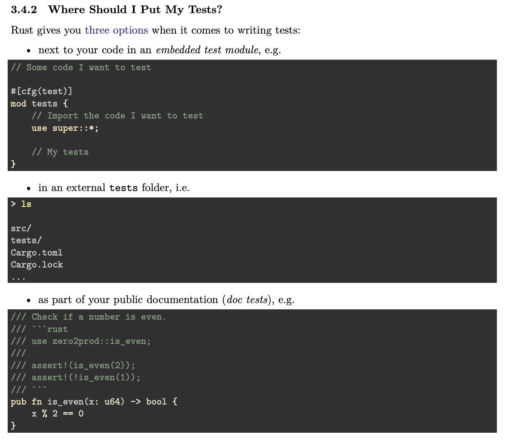

## Readme.md

## Where should you put your tests? 
   

### Changing Our Project Structure For easier Testing

    All the tests written under the folder tests/
    

    1. mkdir -p tests
    2. Create a new tests/health_check.rs file with: 
       
        use zero2pod::main; 
        
        //! tests/health_check.rs
        
        use zero2pod::main;
        #[test]
        fn dummy_test() {
            main()
        }

    cargo test should fail with something similar to: 
    

